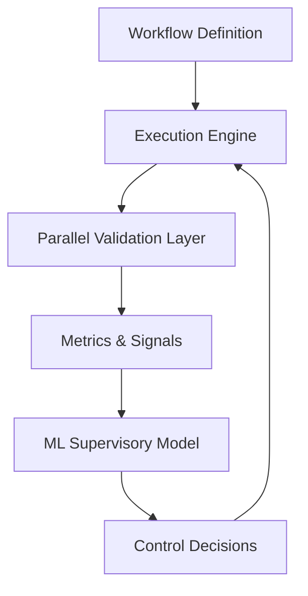
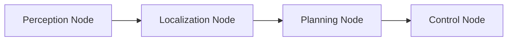
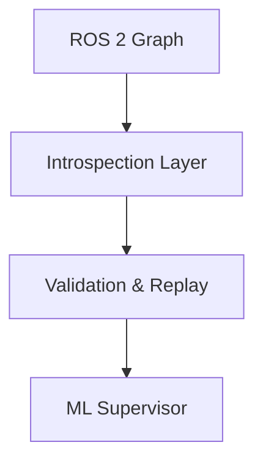

# Control-Theoretic ML for Robotics Workflows

## Overview

Control-Theoretic ML for Robotics Workflows is a research-driven framework that applies principles from robotics control theory to the **design, execution, and validation of robotics software workflows**. Rather than learning robot actions or replacing planners and controllers, this system focuses on *governing* how robotics pipelines behave under uncertainty, timing constraints, and variation.

The core idea is simple but underexplored:

> Robotics systems fail more often due to integration, timing, and validation issues than due to insufficient intelligence. This framework uses machine learning as a *supervisory control layer* to reason about workflow stability, correctness, and reliability.

The project is designed to run entirely on a single development machine, without requiring physical robots or simulators, while remaining compatible with real robotics stacks such as ROS 2.

---

## What This Project Is — and Is Not

### This project **is**:

* A validation and governance layer for robotics workflows
* Inspired by control theory, not end-to-end policy learning
* Focused on reproducibility, determinism, and failure analysis
* Compatible with ROS 2 graphs, bags, and execution models
* Designed for robotics engineers, not abstract ML benchmarks

### This project **is not**:

* A robot motion controller
* A reinforcement learning policy
* A simulator or physics engine
* A perception or planning model
* A low-code abstraction that hides system details

Machine learning is used here as a **meta-level system intelligence**, not as a replacement for robotics logic.

---

## Motivation

Modern Robotics development is dominated by:

* Complex, multi-node software graphs
* Tight latency and jitter constraints
* Partial observability and noisy data
* Fragile assumptions embedded in glue code

Validation is typically:

* Ad hoc
* Sequential
* Manual
* Difficult to reproduce

This project treats a robotics workflow itself as a *dynamic* system that can be analyzed, perturbed, replayed, and stabilized using control-theoretic ideas.

---

## Invariant's System Level Architecture

### High-Level Architecture

The system forms a closed feedback loop, analogous to classical control systems.

---

## Workflow Representation

Workflows are represented as structured graphs:

* Nodes represent components (e.g., perception, planning, control)
* Edges represent data or control flow
* Each node emits timing and validation signals

This representation enables both graph-based learning and formal validation.

---

## Machine Learning Model

### Model Role

The ML model learns relationships between:

* Workflow structure
* Temporal behavior
* Validation outcomes

and predicts:

* Probability of failure
* Sensitivity to perturbations
* Likely failure classes
* Confidence and stability scores

### Model Characteristics

* Graph-aware (e.g., GNN-style message passing)
* Temporal reasoning over execution windows
* Trained on synthetic and replayed workflows
* No action or control outputs by design

This ensures the model remains a *governor*, not an actor.

---

## Validation Modes

### Structural Validation

* Graph topology consistency
* Topic and interface compatibility
* Contract enforcement

### Temporal Validation

* Latency budgets
* End-to-end timing
* Jitter and variance detection

### Behavioral Validation

* Divergence across replayed runs
* Sensitivity to noise and delays
* Stability under controlled perturbations

---

## ROS 2 Integration

The framework integrates with ROS 2 non-invasively:

* Introspects node graphs
* Subscribes to live or bagged data
* Mirrors execution without interfering

No modifications to existing ROS 2 nodes are required.

---

## Development Philosophy

* Transparency over abstraction
* Determinism over convenience
* Validation as a first-class concern
* ML decisions must be inspectable and auditable

The framework assumes users are engineers who want leverage, not automation theater.

---

## Intended Audience

This project is intended for:

* Robotics engineers
* Autonomous systems developers
* Research teams working on complex robotics stacks
* Engineers who understand and value system constraints

It is explicitly **not** designed as a beginner-friendly robotics toolkit.

---

## About

Control-Theoretic ML for Robotics Workflows explores a missing layer in modern robotics: the governance of complex software systems using machine learning informed by control theory. By treating workflows themselves as dynamic systems, the project aims to make robotics development more predictable, reproducible, and trustworthy.

Rather than focusing on what a robot should do, this work focuses on whether the system responsible for deciding *can be trusted to behave consistently*. The long-term goal is to reduce integration risk and validation overhead while preserving full visibility and control for engineers.

---

## Status

This project is under active research and development. The current focus is on:

* Abstract workflow modeling
* Parallel validation infrastructure
* ML-based stability and failure prediction

Hardware integration is intentionally deferred.
