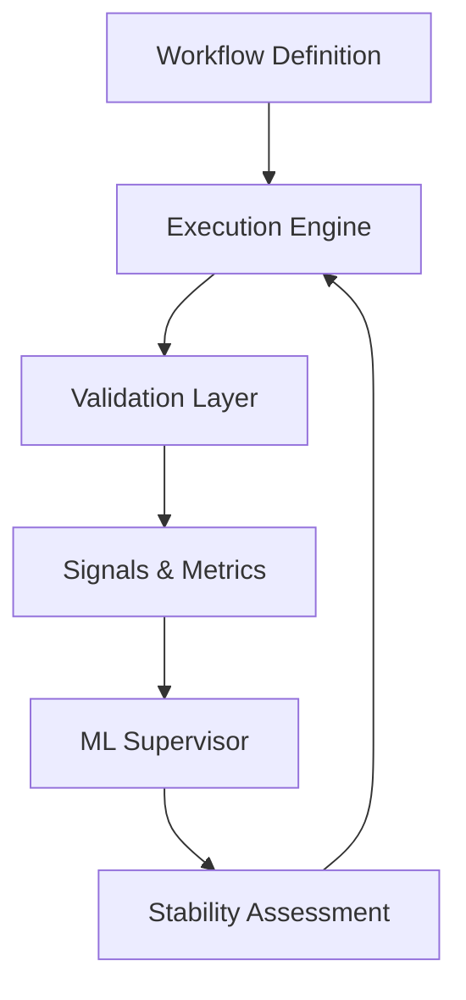

# Invariant: Control-Theoretic ML for Robotics Workflows

[](https://www.python.org/)
[](LICENSE)
[](https://developer.nvidia.com/cuda-zone)

## Overview

**Invariant** is a research-grade robotics software framework that applies control-theoretic principles to the governance and validation of robotics pipelines. Unlike traditional robot controllers or simulators, Invariant acts as a supervisory layer that treats the software workflow itself as a dynamic system.

It is designed to be deterministic, reproducible, and explainable, providing robotics engineers with a powerful tool to analyze timing drift, integration errors, and system stability under perturbation.

---

## Philosophy & Core Principles

Robotics systems often fail at the integration layer. Invariant addresses this by implementing a closed-loop validation structure:

1.  **Workflow Definition**: Declarative graph representation of the robotics pipeline.
2.  **Execution Engine**: Strictly deterministic execution with seeded fault injection.
3.  **Validation Layer**: Composable passes for structural, temporal, and behavioral analysis.
4.  **ML Supervisor**: Supervisory observer that predicts instability and failure risk.

### Non-Goals (Must Not Implement)
- **No Physical Control**: Does not control motors or hardware.
- **No Planning**: Does not compute trajectories or paths.
- **No Perception**: Does not implement CV or sensor fusion models.
- **No Simulation**: Does not simulate physics (uses logical timing instead).

---

## Architecture



---

## Getting Started

### Installation

```bash
pip install -e .
```

### Usage

Run the validation pipeline on a workflow:

```bash
invariant validate examples/simple_workflow.yaml --runs 10 --latency-max 50.0
```

This will:
1. Load the workflow DAG.
2. Execute it 10 times with deterministic seeded perturbations.
3. Perform structural, temporal (latency budget), and behavioral (divergence) validation.
4. Compute a stability score.
5. Generate a `stability_report.md`.

---

## Project Structure

- `invariant/workflow/`: Declarative node and graph abstractions.
- `invariant/execution/`: Deterministic engine and perturbation logic.
- `invariant/validation/`: Stability and divergence validators.
- `invariant/ml/`: Predictive supervisor and feature extraction.
- `invariant/ros/`: Passive ROS 2 introspection bridge.
- `invariant/reporting/`: Human and machine-readable reports.

---

## License

MIT License. See `LICENSE` for details.
